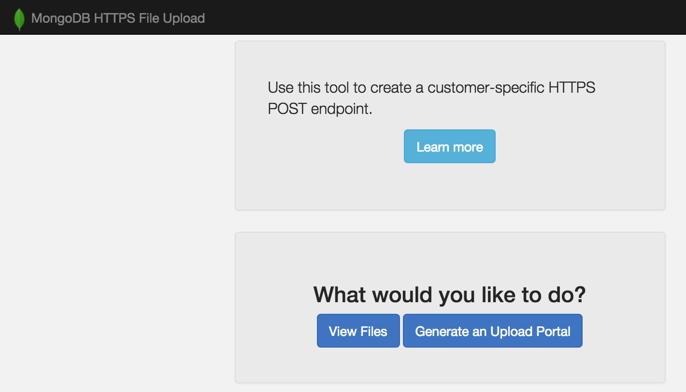
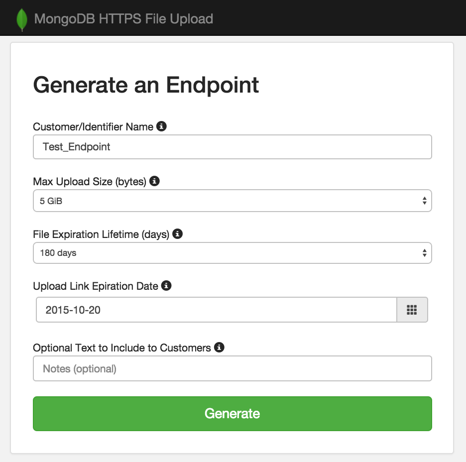
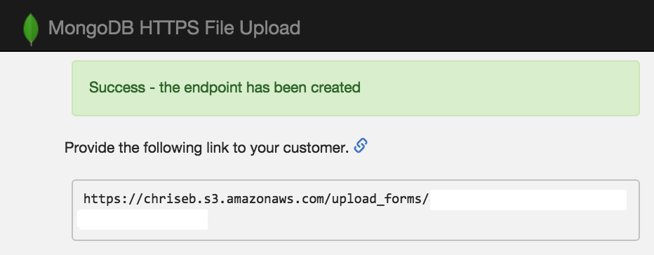
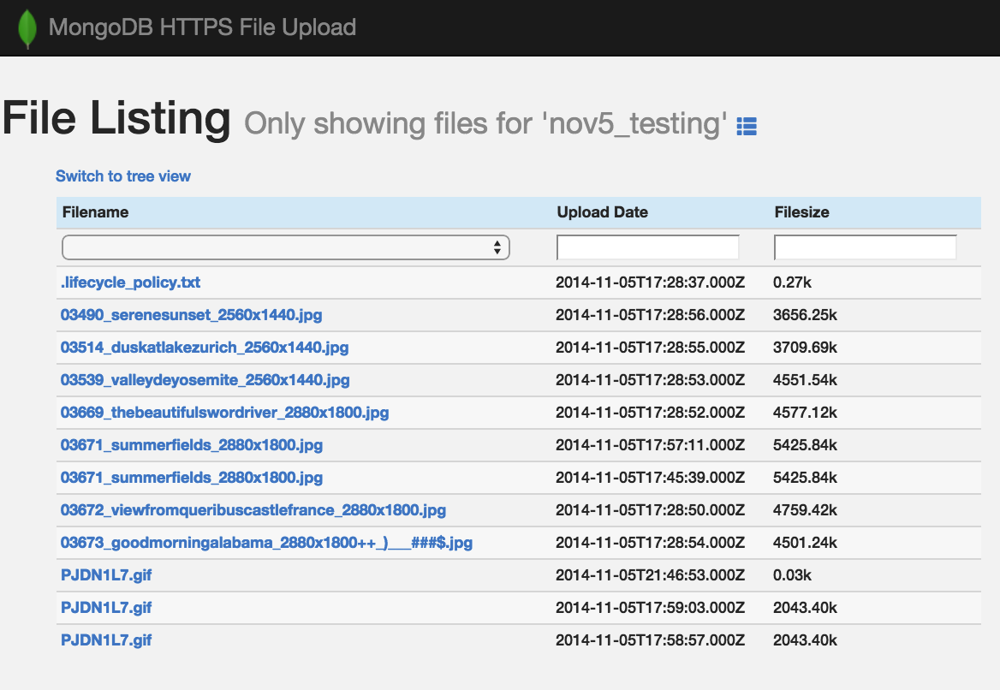
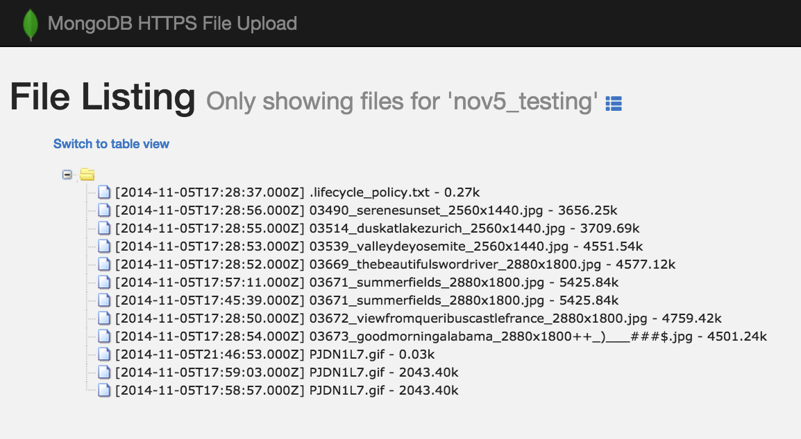
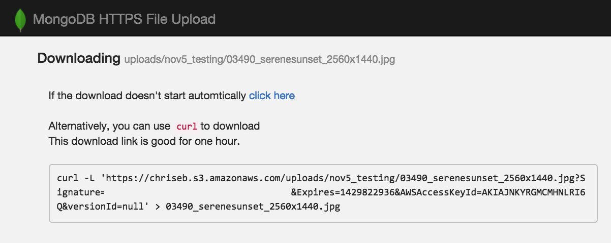

# S3 HTTPS Upload Portal

## What is this?

This tool is used to create an HTTPS upload endpoint for customers to use. The endpoint can be used to upload file(s) via a web browser or command line tools, such as `curl`.

This is useful if you wish to give your customers (or whoever) the ability to upload files that only you can access, and to do so without requiring you to actually maintain any infrastructure. 

Customers upload directly to s3, using pre-generated and pre-signed URLs (with policies). This means uploads are over TLS, and files are stored with server side encryption. Files also automatically expire at 180 days and delete themselves, so you can worry less about the data lifecycle.

## What do customers see?

A customer will just be given a link. That link provides a way for them to upload files. That customer can drag-and-drop files right into the browser, or select files, or also use `curl` if they want to use command line tool.

When a customer visits the link, they'll see:


### Generating that link

This python web application is what actually generates the link. The app preps a bucket, uploads and sets permissions for all the static files, generates portal endpoints for customers to use, and also provides a way for employees to view the uploaded files.

When you first visit the app front page, you see:



Clicking the 'Generate an Upload Portal' brings you to:



From here, you enter in some info - the most important of which is the name. This is essentially the 'folder' that things get uploaded to. The other fields have sane defaults and you can leave as is.

When this is done, the web application generates an HTML page that gets uploaded to s3, which is publicly accessible but has a GUID ID, so it cannot be guessed. All you need to do is copy/paste that link to your customers and they can start uploading.



### Downloading Uploaded Files

All files go into S3. You have a number of ways to access this. If your internal users have access to S3 (for example, via the Amazon web console), they could simply use that.

However, if you are enforcing principle of least privilege and most users do not have access to AWS, then the app itself acts as a download portal.

From the front page shown above, there is a 'View Files' option. When you click this, you are presented with a table of every file and folder uploaded. You can switch views between a 'tree' and 'table' depending on your preference, and drill down to individual folders to make it easier to send a link to just that folder. Examples:





When you click a file to download, the web application generates a temporary pre-signed download URL link, which is good for one hour. Also, a `curl` command is given.



### Authentication

Its extremely important to realize that this web application does not have a layer of authentication built in. That is, when you deploy this app, determine how you want to limit access to this application. Do NOT make it accessible to /0 otherwise anyone could use it to just download your files.

If you deploy this to elastic beanstalk, make sure to adjust the associated security-group.

Some options: implement a layer of authentication at a load balancer fronting the application, add basic authentication, use IP whitelisting via security-groups to limit access to the host, deploy on a private network.

## Requirements

This application is a python flask application, designed to be deployed via elastic beanstalk in AWS. Although it is intended to be run in elastic beanstalk, you could run it as a standalone python app, too.

## Configuration

There are three required configuration parameters. Since this is intended for elastic beanstalk, those parameters are read from environment variables. The params are:

* The name of the bucket where everything will be stored
* AWS Access Key ID
* AWS Secret Key

## Deployment

* Clone this repo
* Make an elastic beanstalk zip archive:

`zip -r archive.zip application.py libs requirements.txt static templates`

Note; you must create a zip in this manner. Elastic Beanstalk requires all files unzip and NOT have a top level directory. If you 'download Zip' from GitHub, you get a top level directory and elastic beanstalk won't work.

* Create a new elastic beanstalk environment
  * Details are out of scope of this doc; you can select single instance, python 2.7
* Choose 'upload archive', and select the zip created earlier.


### AWS Key Scope

The application needs full access to the bucket it is going to store files in. 

#### Restricted S3 Credentials

Considering a bucket named `https_upload_bucket`:

* Create an API key w/ the following scope:

```js
{
  "Version": "2012-10-17",
  "Statement": [
    {
      "Effect": "Allow",
      "Action": "s3:*",
      "Resource": [
         "arn:aws:s3:::https_upload_bucket/*",
         "arn:aws:s3:::https_upload_bucket"
        ]
    }
  ]
}
```

This restricts the credential to just that bucket.

## Notes and Misc

* Remember, this app has no auth. Don't just deploy and leave it; restrict access somehow!
* The max size of a single uploaded file is 5GB. AWS S3 supports [multipart upload](http://docs.aws.amazon.com/AmazonS3/latest/API/mpUploadInitiate.html) which supports much larger single keysizes, however I have no plans to support this. If your customers need to upload files > 5GiB, ask them to tar and split the file into 5GiB chunks.
* Its a good idea to set alarms in S3 or otherwise keep an eye on the data usage.
* Right now, logging goes to a log file. This needs to be changed to STDOUT to make it easier to get logs when in Elastic Beanstalk.
* Buckets are created using version control; if you try to delete things, remember to show (and delete) versions.
* If you dev/test locally, set your config params in your shell via something like:

```bash
export BUCKET=bucket_name
export AWS_ACCESS_KEY_ID=key
export AWS_SECRET_KEY=secret
```

## Contributing

Issues should be created using GitHub issues. If you have an addition, please fork and submit a pull request.

## License 

Copyright 2015 Chris Sandulow

Licensed under the Apache License, Version 2.0 (the "License");
you may not use this file except in compliance with the License.
You may obtain a copy of the License at

    http://www.apache.org/licenses/LICENSE-2.0

Unless required by applicable law or agreed to in writing, software
distributed under the License is distributed on an "AS IS" BASIS,
WITHOUT WARRANTIES OR CONDITIONS OF ANY KIND, either express or implied.
See the License for the specific language governing permissions and
limitations under the License.